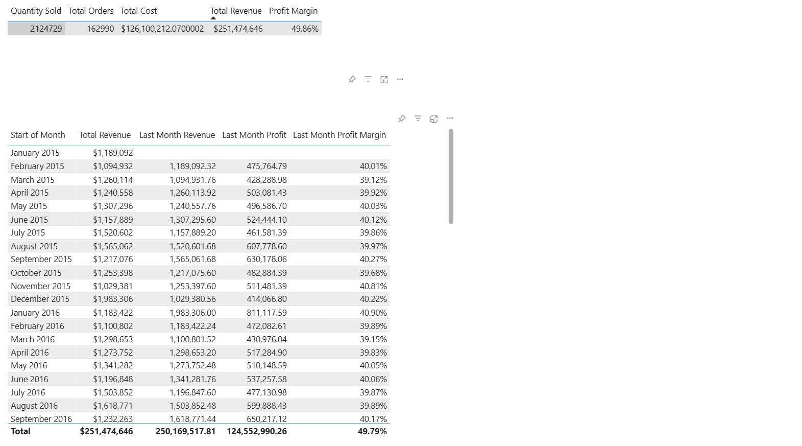

# Maven-Cycles-Sales-Analysis

Practice work based on PL-300 Certification course (Maven Cycles dataset)

---

## 📊 Project Overview

This repository contains my Power BI dashboard project created during the **Microsoft Power BI PL-300 Certification Prep Course on Udemy**.

The dataset used is from Maven Cycles, simulating a bike product sales company. The dashboard includes key metrics and visual analytics such as:

- Revenue, Profit, and Profit Margin
- Product Performance Breakdown
- Revenue by Country
- Profit by Category
- Monthly Profit Trends
- Key Influencer Analysis
- Decomposition Tree
- Clustering and Region-based Sales Analysis

---

## 🔍 Key Report Pages & Visuals

### 📌 Executive View

### 📌 Key Influencers

### 📌 Sandbox (Data Table)

### 📌 Decomposition Tree

### 📌 Clustering & Grouping

---

## 🧩 Data Model

This is the data model used to relate and organize data tables in Power BI:

---

## ⚒️ Tools & Features Used

- Microsoft Power BI Desktop
- DAX Calculations
- Visual Filters & Bookmarks
- Clustering, Decomposition Tree, Key Influencers Visuals
- Data Modeling with Relationships

---

## 📚 Source

This work was done as part of the [PL-300 Power BI Certification Prep Course on Udemy](https://www.udemy.com/course/microsoft-power-bi-certification-da-100-exam-prep/).

---
